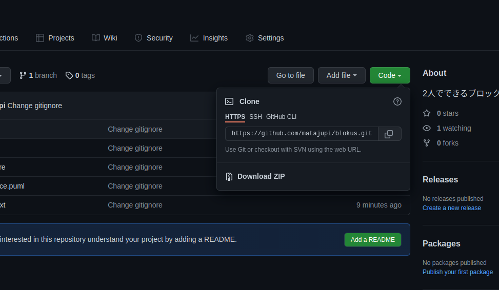

# 2人用Blokus
## 環境構築（Windows用）
### ダウンロード
Download ZIPを押してダウンロードする。

ダウンロードしたフォルダーを解凍する。
### 移動
Powershellもしくはコマンドプロンプトを起動する。
"cd"コマンドを用いてダウンロードしたフォルダーのトップディレクトリに移動する。

```
~~~\~~~> cd ファイル名 or ディレクトリ名
```
```
~~~\blokus>
```
となるようなディレクトリにいけたらOK。

注意：以下のように複数のblokusディレクトリにも入れるがそこではない。
```
~~~\blokus\blokus>
```
### 仮想環境の構築
次に以下のコマンドをうち仮想環境を構築する。
```
~~~\blokus> python -m venv env
```
### 仮想環境へ入る
以下のコマンドで仮想環境へ入ることができる。
```
~~~\blokus> .\env\Scripts\activate
```
すると以下のように変わるはずである。
```
(env) ~~~\blokus>
```
### 依存関係の解決
仮想環境に入った状態で以下のコマンドを実行する。
```
(env) ~~~\blokus> pip install -r requirements.txt
```
するとパッケージのインストールが開始されるはずである。
### サーバー立ち上げ
仮想環境に入った状態で以下のコマンドを実行する。
```
(env) ~~~\blokus> cd blokus
(env) ~~~\blokus\blokus> python run.py
INFO:     Started server process [214435]
INFO:     Waiting for application startup.
INFO:     Application startup complete.
INFO:     Uvicorn running on http://xxx.xxx.xxx.xxx:8000 (Press CTRL+C to quit)
```
すると以下のような上のような結果が帰ってくるはずである。
### 実行
上の出力のhttp://xxx.xxx.xxx.xxx:8000 となっている部分をコピーしてブラウザのURL欄に貼り付ける。
上の動作を2回行い2つのBlokusが開かれる状態にする。
すると自動的にゲームが開始する。
### サーバーを止める
サーバーを止めるときはサーバーが動いているPowershellまたはコマンドプロンプト上でCTRL + Cを押す。
###  仮想環境を抜ける
仮想環境を抜けるときは以下のコマンドを入力する。
```
(env) ~~~\blokus> deactivate
```
すると以下のように戻るはずである。
```
~~~\blokus>
```